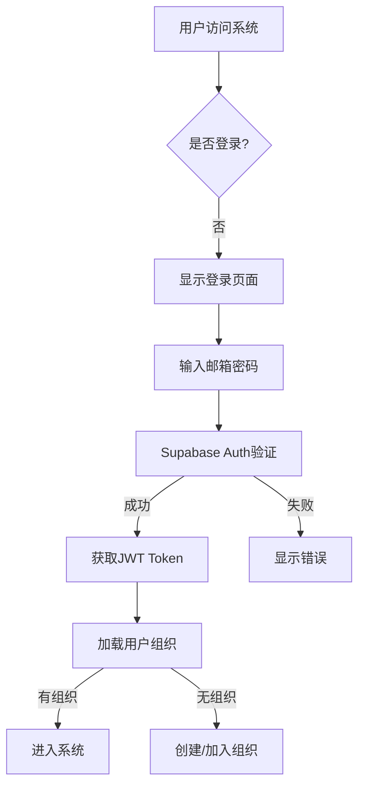

# Authentication & Organization Management - Implementation Plan

**Version**: 3.0
**Date**: 2025-01-27
**Status**: Ready for Implementation

## 1. Executive Summary

基于 MVP 原则和最小化设计理念，采用最简单可靠的方案实现用户认证和组织管理功能。

### 核心决策

1. **认证方式**：仅使用邮箱+密码登录（最简单）
2. **组织模式**：个人组织或加入现有组织（二选一）
3. **权限设计**：简单的 admin/member 角色（最多3个管理员）
4. **数据隔离**：Row Level Security (RLS) 基于 org_id
5. **无需迁移**：清空现有测试数据，重新建表

## 2. Authentication Design

### 2.1 登录方式

**仅实现邮箱+密码登录**

```typescript
// 登录请求
interface LoginRequest {
  email: string        // 邮箱
  password: string     // 密码（最少8位）
}

// 注册请求
interface RegisterRequest {
  email: string        // 邮箱
  password: string     // 密码
  name: string         // 用户姓名
  org_id?: string      // 可选：加入现有组织
}
```

### 2.2 认证流程



### 2.3 密码规则

- 最少8个字符
- 必须包含：大写字母 + 小写字母 + 数字
- 可选：特殊字符
- 支持密码重置（通过邮箱）

## 3. Organization Management

### 3.1 组织创建规则

**两种路径**：

1. **创建个人组织**（默认）
   - 自动命名："{用户姓名}的组织"
   - 用户成为管理员
   - 立即可用

2. **加入现有组织**
   - 输入组织ID（6位代码）
   - 创建待审批请求
   - 管理员审批后可用

### 3.2 成员管理

```typescript
// 组织成员状态
enum MemberStatus {
  PENDING = 'pending',     // 待审批
  APPROVED = 'approved',   // 已批准
  REJECTED = 'rejected'    // 已拒绝
}

// 成员角色
enum MemberRole {
  ADMIN = 'admin',         // 管理员（最多3个）
  MEMBER = 'member'        // 普通成员
}
```

### 3.3 管理员权限

管理员可以：
- ✅ 审批/拒绝成员申请
- ✅ 提升成员为管理员（限3个）
- ✅ 移除普通成员
- ✅ 查看所有组织数据

管理员不能：
- ❌ 移除自己（创建者例外）
- ❌ 降级其他管理员（仅创建者可以）
- ❌ 删除组织（需要所有管理员同意）

## 4. Database Schema (Clean Slate)

### 4.1 核心表结构

```sql
-- 1. 组织表
CREATE TABLE organizations (
    id UUID PRIMARY KEY DEFAULT gen_random_uuid(),
    name VARCHAR(255) NOT NULL,
    org_code VARCHAR(6) UNIQUE NOT NULL, -- 6位唯一代码
    created_by UUID NOT NULL REFERENCES auth.users(id),
    created_at TIMESTAMP WITH TIME ZONE DEFAULT CURRENT_TIMESTAMP
);

-- 2. 组织成员表
CREATE TABLE org_members (
    id SERIAL PRIMARY KEY,
    org_id UUID NOT NULL REFERENCES organizations(id) ON DELETE CASCADE,
    user_id UUID NOT NULL REFERENCES auth.users(id) ON DELETE CASCADE,
    role VARCHAR(50) DEFAULT 'member' CHECK (role IN ('admin', 'member')),
    status VARCHAR(50) DEFAULT 'pending' CHECK (status IN ('pending', 'approved', 'rejected')),
    requested_at TIMESTAMP WITH TIME ZONE DEFAULT CURRENT_TIMESTAMP,
    approved_at TIMESTAMP WITH TIME ZONE,
    approved_by UUID REFERENCES auth.users(id),
    UNIQUE(org_id, user_id)
);

-- 3. 用户配置表
CREATE TABLE users (
    id UUID PRIMARY KEY REFERENCES auth.users(id),
    name VARCHAR(255) NOT NULL,
    email VARCHAR(255) NOT NULL UNIQUE,
    current_org_id UUID REFERENCES organizations(id),
    created_at TIMESTAMP WITH TIME ZONE DEFAULT CURRENT_TIMESTAMP
);

-- 4. 更新业务表（添加 org_id）
ALTER TABLE candidates ADD COLUMN org_id UUID NOT NULL REFERENCES organizations(id);
ALTER TABLE positions ADD COLUMN org_id UUID NOT NULL REFERENCES organizations(id);
-- 其他表类似...
```

### 4.2 RLS 策略（极简版）

```sql
-- 通用策略：只能看到自己组织的数据
CREATE POLICY "org_isolation" ON candidates
FOR ALL USING (org_id = (
    SELECT current_org_id FROM users WHERE id = auth.uid()
));

-- 应用到所有业务表
-- positions, position_candidates, interview_feedbacks 等
```

## 5. Backend Implementation Tasks

### 5.1 认证相关 API

```python
# 新增的 API 端点
POST   /api/auth/register          # 注册
POST   /api/auth/login             # 登录
POST   /api/auth/logout            # 登出
GET    /api/auth/me                # 获取当前用户
POST   /api/auth/reset-password    # 密码重置

# 组织管理 API
GET    /api/organizations          # 用户的组织列表
POST   /api/organizations          # 创建组织
GET    /api/organizations/{id}     # 组织详情
POST   /api/organizations/join     # 申请加入
GET    /api/organizations/{id}/members     # 成员列表
POST   /api/organizations/{id}/members/approve   # 审批成员
DELETE /api/organizations/{id}/members/{user_id} # 移除成员
```

### 5.2 中间件改造

```python
# JWT 验证中间件
async def require_auth(request: Request):
    token = request.headers.get("Authorization")
    if not token:
        raise HTTPException(401, "未登录")

    try:
        # 验证 Supabase JWT
        payload = jwt.decode(token, SUPABASE_JWT_SECRET)
        user_id = payload["sub"]

        # 获取用户当前组织
        user = await get_user_with_org(user_id)
        if not user.current_org_id:
            raise HTTPException(403, "未加入组织")

        request.state.user = user
        request.state.org_id = user.current_org_id
    except:
        raise HTTPException(401, "Token 无效")
```

### 5.3 Service 层改造

所有 Service 需要注入 org_id：

```python
class CandidateService(BaseService):
    def __init__(self, supabase: Client, org_id: str):
        super().__init__(supabase, "candidates")
        self.org_id = org_id

    def get_all(self, **filters):
        # 自动添加 org_id 过滤
        filters['org_id'] = self.org_id
        return super().get_all(**filters)
```

## 6. Frontend Implementation Tasks

### 6.1 认证页面

```typescript
// 新增页面
/login              # 登录页
/register           # 注册页
/forgot-password    # 忘记密码
/organization/join  # 加入组织
/organization/create # 创建组织
/pending-approval   # 等待审批
```

### 6.2 认证状态管理

```typescript
// Auth Context
interface AuthContextType {
  user: User | null
  organization: Organization | null
  isAdmin: boolean
  login: (email: string, password: string) => Promise<void>
  logout: () => Promise<void>
  register: (data: RegisterData) => Promise<void>
}

// Protected Route
function ProtectedRoute({ children }) {
  const { user, organization } = useAuth()

  if (!user) return <Navigate to="/login" />
  if (!organization) return <Navigate to="/organization/join" />
  if (organization.status === 'pending') return <PendingApproval />

  return children
}
```

### 6.3 组织管理组件

```typescript
// 组织切换器（顶部导航栏）
function OrgSwitcher() {
  const { organization, switchOrg } = useAuth()
  const { data: orgs } = useMyOrganizations()

  return (
    <Select value={organization.id} onChange={switchOrg}>
      {orgs.map(org => (
        <Option key={org.id} value={org.id}>{org.name}</Option>
      ))}
    </Select>
  )
}

// 成员管理面板（仅管理员可见）
function MemberManagement() {
  const { data: pending } = usePendingMembers()
  const approveMutation = useApproveMember()

  return (
    <Card>
      <h3>待审批成员 ({pending.length})</h3>
      {pending.map(member => (
        <MemberRequest
          key={member.id}
          member={member}
          onApprove={() => approveMutation.mutate(member.id)}
        />
      ))}
    </Card>
  )
}
```

## 7. Implementation Phases

### Phase 1: Database Setup (Day 1)
- [ ] 备份现有数据
- [ ] 创建新的数据库 schema
- [ ] 设置 RLS 策略
- [ ] 创建初始测试数据

### Phase 2: Backend Auth (Day 2-3)
- [ ] Supabase Auth 集成
- [ ] JWT 中间件
- [ ] 认证 API 端点
- [ ] 组织管理 API

### Phase 3: Backend Services (Day 4-5)
- [ ] 改造所有 Service 类
- [ ] 添加 org_id 注入
- [ ] 更新 API 路由
- [ ] 测试数据隔离

### Phase 4: Frontend Auth (Day 6-7)
- [ ] 登录/注册页面
- [ ] Auth Context
- [ ] Protected Routes
- [ ] Token 管理

### Phase 5: Frontend Organization (Day 8-9)
- [ ] 组织创建/加入流程
- [ ] 成员管理面板
- [ ] 组织切换器
- [ ] 审批流程

### Phase 6: Testing & Polish (Day 10)
- [ ] 端到端测试
- [ ] 错误处理
- [ ] UI 优化
- [ ] 文档更新

## 8. Task Breakdown Summary

### Backend Tasks (20个)

#### 数据库任务 (4个)
1. 创建认证相关表结构
2. 更新业务表添加 org_id
3. 设置 RLS 策略
4. 创建数据库初始化脚本

#### 认证服务 (6个)
5. Supabase Auth 配置
6. JWT 验证中间件
7. 用户注册 API
8. 用户登录 API
9. 密码重置 API
10. 获取当前用户 API

#### 组织服务 (5个)
11. 创建组织 API
12. 加入组织 API
13. 成员审批 API
14. 成员管理 API
15. 组织切换 API

#### Service层改造 (5个)
16. BaseService 添加 org_id 支持
17. CandidateService 改造
18. PositionService 改造
19. InterviewFeedbackService 改造
20. SmartScreeningService 改造

### Frontend Tasks (20个)

#### 认证页面 (5个)
1. 登录页面组件
2. 注册页面组件
3. 忘记密码页面
4. 邮箱验证页面
5. 密码强度组件

#### 组织页面 (5个)
6. 创建组织页面
7. 加入组织页面
8. 等待审批页面
9. 组织管理页面
10. 成员列表组件

#### 状态管理 (5个)
11. Auth Context 实现
12. Protected Route 组件
13. Token 存储管理
14. API 拦截器配置
15. 组织状态管理

#### UI组件 (5个)
16. 组织切换器组件
17. 用户菜单组件
18. 成员卡片组件
19. 权限提示组件
20. 审批操作组件

## 9. Risk Mitigation

### 风险点
1. **数据迁移风险** → 解决：清空测试数据，无需迁移
2. **JWT复杂度** → 解决：使用 Supabase 内置 JWT
3. **RLS性能** → 解决：简单策略 + 索引优化
4. **组织切换复杂** → 解决：单组织模式，不支持切换

### 安全考虑
- ✅ 所有API需要认证
- ✅ RLS强制数据隔离
- ✅ 密码强度验证
- ✅ Rate limiting（后期添加）
- ✅ 审计日志（后期添加）

## 10. Success Criteria

### 功能验收
- [ ] 用户可以注册和登录
- [ ] 用户可以创建或加入组织
- [ ] 管理员可以审批成员
- [ ] 数据严格隔离（不同组织看不到对方数据）
- [ ] 所有原有功能正常工作

### 性能指标
- 登录响应时间 < 1秒
- 组织切换 < 500ms
- RLS 查询性能损耗 < 10%

### 用户体验
- 清晰的注册流程
- 友好的错误提示
- 直观的组织管理
- 流畅的状态切换

## 11. Next Steps

1. **立即开始**：数据库 schema 设计和创建
2. **优先级高**：后端认证 API 实现
3. **依赖项**：前端需要等待后端 API 完成
4. **测试策略**：每个模块完成后立即测试

---

**准备状态**：✅ 方案已确定，可以开始实施
**预计工期**：10个工作日
**开始时间**：立即开始